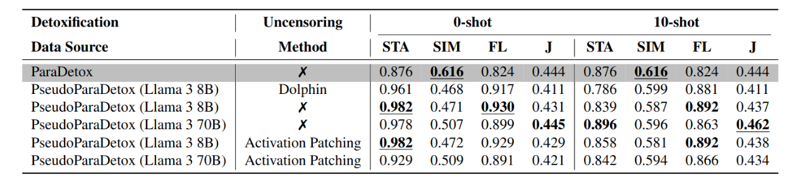

<h1 align="center">LLMs to Replace Crowdsourcing For Parallel Data Creation? The Case of Text Detoxification</h1>


<div align="center">


[](https://2024.emnlp.org)
[](https://s-nlp.github.io/pseudoparadetox/)
</div>


This is the official implementation of the paper [LLMs to Replace Crowdsourcing For Parallel Data Creation? The Case of Text Detoxification](https://aclanthology.org/2024.findings-emnlp.839.pdf) by Daniil Moskovskiy, Sergey Pletenev and Alexander Panchenko.

## Abstract

The lack of high-quality training data remains a significant challenge in NLP. Manual annotation methods, such as crowdsourcing, are costly, require intricate task design skills, and, if used incorrectly, may result in poor data quality. From the other hand, LLMs have demonstrated proficiency in many NLP tasks, including zero-shot and few-shot data annotation. However, they often struggle with text detoxification due to alignment constraints and fail to generate the required detoxified text. This work explores the potential of modern open source LLMs to annotate parallel data for text detoxification. Using the recent technique of activation patching, we generate a pseudo-parallel detoxification dataset based on ParaDetox. The detoxification model trained on our generated data shows comparable performance to the original dataset in automatic detoxification evaluation metrics and superior quality in manual evaluation and side-by-side comparisons.

## Results


Results of the automatic detoxification evaluation after training BART on the original ParaDetox data (highlighted in `gray`) and generated with LLMs PseudoParaDetox data in 0-shot and 10-shot settings. A.P. stands for Activation Patched models, ❌ stands for models used *as is*. Best results for each setting (0-shot/10-shot) are **bold**, and the best overall results are **_bold italic_**.


Results of the manual detoxification evaluation after training BART on the original ParaDetox data (highlighted in `gray`) and generated with LLMs PseudoParaDetox data in 0-shot and 10-shot settings. A.P. stands for Activation Patched models, ❌ stands for models used *as is*. Best results for each setting (0-shot/10-shot) are **bold**, and the best overall results are **_bold italic_**.


Side-by-side evaluation BART trained on ParaDetox versus PseudoParaDetox (generated by activation patched LLMs) on a held-out test set. Win of PseudoParaDetox (<span style="color: #2FBEAD">■</span>), Tie (<span style="color: #E8D5C4">■</span>) and ParaDetox (<span style="color: #E8ECEE">■</span>).

## Quick start

For synthetic data generation you need abbliterated model. You can make model with code in [/noteboks/RefusalsRemover.ipynb](https://github.com/s-nlp/pseudoparadetox/blob/main/notebooks/RefusalsRemover.ipynb) or use already patched model like [
Meta-Llama-3-8B-Instruct-abliterated-v3](https://huggingface.co/failspy/Meta-Llama-3-8B-Instruct-abliterated-v3) or [Meta-Llama-3.1-8B-Instruct-abliterated](https://huggingface.co/mlabonne/Meta-Llama-3.1-8B-Instruct-abliterated)

Next, you need to generate synthetic non-toxic data with patched model

```bash
for lang in en
do
    python detoxer.py --language $lang --model_path "mlabonne/Meta-Llama-3.1-8B-Instruct-abliterated" \
    --nshot 10 --batch_size 8 \
    --output_path ./datasets/Meta-Llama-3.1-8B-Instruct_abliterated_10shot_$lang.csv
done
```

In order to check the quality of synthetic data we train two Seq2Seq models with real and synthetic data.

To train BART-large with real data:
```bash
python src/bart_baseline.py --config_path configs/bart_real_train.json --input_columns en_toxic_comment --output_columns en_neutral_sentence
```

To train BART-large with synth data:
```bash
python src/bart_baseline.py --config_path configs/bart_synth_train.json --input_columns en_toxic_comment --output_columns generated_neutral_sentence
```

For validate both BART models:

```bash
python ./src/utils/evaluate.py \
    --source_list path/to/test/ \
    --references_list path/to/test/  \
    --input_path /results/generated/Meta-Llama-3-8B-Instruct-abliterated-v3.5_10shot_t08_p09.txt \
    --output_dir /results/generated.results
```

## Test data

Test part of ParaDetox dataset is available upon [request](mailto:daniil.moskovskiy@skoltech.ru).

## Citation

If you find this work useful, please cite this paper:

```bibtex
@inproceedings{moskovskiy-etal-2024-llms,
    title = "{LLM}s to Replace Crowdsourcing For Parallel Data Creation? The Case of Text Detoxification",
    author = "Moskovskiy, Daniil  and
      Pletenev, Sergey  and
      Panchenko, Alexander",
    editor = "Al-Onaizan, Yaser  and
      Bansal, Mohit  and
      Chen, Yun-Nung",
    booktitle = "Findings of the Association for Computational Linguistics: EMNLP 2024",
    month = nov,
    year = "2024",
    address = "Miami, Florida, USA",
    publisher = "Association for Computational Linguistics",
    url = "https://aclanthology.org/2024.findings-emnlp.839",
    pages = "14361--14373",
    abstract = "The lack of high-quality training data remains a significant challenge in NLP. Manual annotation methods, such as crowdsourcing, are costly, require intricate task design skills, and, if used incorrectly, may result in poor data quality. From the other hand, LLMs have demonstrated proficiency in many NLP tasks, including zero-shot and few-shot data annotation. However, they often struggle with text detoxification due to alignment constraints and fail to generate the required detoxified text. This work explores the potential of modern open source LLMs to annotate parallel data for text detoxification. Using the recent technique of activation patching, we generate a pseudo-parallel detoxification dataset based on ParaDetox. The detoxification model trained on our generated data shows comparable performance to the original dataset in automatic detoxification evaluation metrics and superior quality in manual evaluation and side-by-side comparisons.",
}
```